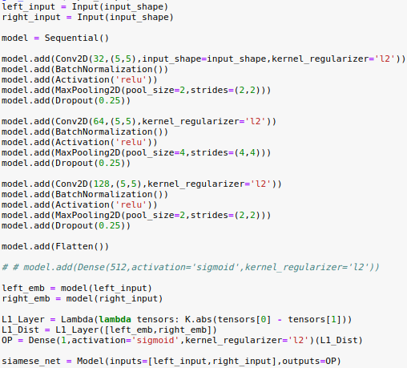

# VeriSign

You can verify the legitimacy of a signature by comparing it with the original signature using this application which uses a trained Deep Learning model in the background.

# Demo

[VeriSign](https://veri-sign.web.app/)

# Model Details

My inspiration for using Siamese Networks for such a purpose was based on Andrew NG's Deep Learning Specialization course and the article [One Shot Learning with Siamese Networks using Keras](https://towardsdatascience.com/one-shot-learning-with-siamese-networks-using-keras-17f34e75bb3d) by [Harshall Lamba](https://github.com/hlamba28).

The dataset [CEDAR Buffalo Signatures Dataset](http://www.cedar.buffalo.edu/NIJ/data/signatures.rar) mentioned in the paper [SigNet: Convolutional Siamese Network for Writer Independent Offline SignatureVerification by Sounak Dey, et. al.](https://arxiv.org/pdf/1707.02131.pdf) was used for training the model. I performed certain pre-processing operations to standardise the size of all the signatures while not affecting their aspect ratios. This modified dataset can be found here: [VeriSign/Datasets/StandardizedSignatures.tar.gz](https://github.com/kartik2112/VeriSign/blob/master/Datasets/StandardizedSignatures.tar.gz)

My notebook which captures these details is present over here: [VeriSign/Trained Notebooks](https://github.com/kartik2112/VeriSign/tree/master/Trained%20Notebooks). 

## Trained Keras Model

## Learning Curves

## Accuracy

Using the mentioned dataset and model, a maximum accuracy of 96-97% was achieved on one of the validation batches. The model currently used in the demo can be found here: [VeriSign/Trained Models/signature-siamese-96Perc-Validatn-Unaugmented.h5](https://github.com/kartik2112/VeriSign/blob/master/Trained%20Models/signature-siamese-96Perc-Validatn-Unaugmented.h5)

## Future Work

Even though on-paper the validation accuracy is very high, and recognizes slight differences possible in the signatures by the original signer, it gives inaccurate results for rotated and skewed images. This means the model is not getting trained on features that are noticed by human signature experts. By increasing the dataset distribution and adding more data augmentation I am attempting to improve this model. Any suggestions to improve this are welcome!

# Deployment Details

The front-end is developed using Angular and a Python Flask Server on the backend. The Angular front-end web-app is a simple application letting the users upload an original and test signature and uploads it to the Flask Server on the backend which uses a trained Deep Learning model developed using Tensorflow-Keras. The front-end is deployed on Firebase and the Flask Server is deployed on Heroku. The links detailing this procedure are mentioned at the end of this README.

# Useful Links

* [Deploying an Angular App to Firebase Hosting](https://alligator.io/angular/deploying-angular-app-to-firebase/)
* [Deploying a Flask Application to Heroku](https://stackabuse.com/deploying-a-flask-application-to-heroku/)
